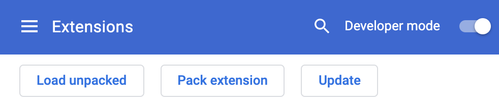

<p align="center">
  
</p>

<p>A chrome extension which allows you to monitor yourself to imporve your study efficiency and learn anything with your own cartoon partner. </p>

## How to start to use
You can either run the following command in terminal
```bash
git clone https://github.com/shawPLUSroot/fOoOcus.git
```
Or you may directly download the zip file. After uncompressing fOoOcus.zip, please open your chrome browser. Next, go to chrome://extensions/ and select the Developer mode

Then click the Load unpacked extension to import your fOoOcus file


## Inspiration
During the COVID-19 tough time, universities and schools have to choose to make classes change from in person into online, students across the world have to adapt it. However, many of them have trouble fitting themselves in time slots of classes, focusing on the contents that the educators tell and doing homework lonely. So we wanted to provide an application for students to imporve their efficiency and help them go through this tough period.

## What's next for fOoOcus
Face-api only supports six emotions, in this case, we cannot combine it with the feature of detecting if the user study efficiently and give positive feedback in time. Next, we would train more models to ensure the study partner can "talk" with the user according to their emotions for better learning.

## LICENSE
<a href="LICENSE">
    
</a>